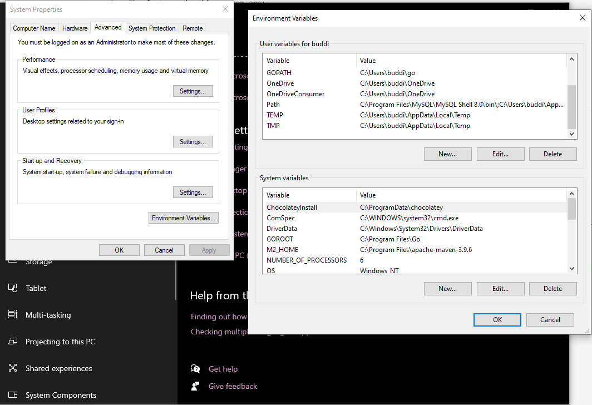

# Software Development Assignment 1 - GP Surgery Booking and Management System

## Description
This is a piece of software for a GP Surgery. They needed a system that allowed patients to book and cancel appointments, look at notes and prescriptions, and change doctors.
The features of this system are:
- Registering as a new patient
- Log in and out of the system
- Changing doctor
- Book appointments
- Reschedule appointments
- Log all access to the system
- View appointment details
- View prescriptions
- View all bookings <br>
This software will look similar to the current NHS booking system, however, it will be more efficient and easily accessible.

## Authors and acknowledgement
# Authors
Georgie Parkin - GEHP2 <br>
Lily Bradshaw - CB2004 <br>
James Aris - JA758 <br>
James Foulstone - JF533 <br>
Zack Njoroge - ZN49 <br>

# acknowledgements
This project uses Maven, an open-source project management tool for Java applications.
The database is hosted on an AWS (Amazon Web Server)

## Project status
The project is completed, and looking for feedback; any issues, please let us know. Enjoy our creation.

## Initial Setup & Guide (for Windows)

1. Clone the repository (each line is a separate command to type):

    ```bash
    git clone git@git.cs.kent.ac.uk:gehp2/software-development-assignment-1.git
    cd software-development-assignment-1
    ```

2. Install [Apache Maven](https://dlcdn.apache.org/maven/maven-3/3.9.6/binaries/apache-maven-3.9.6-bin.zip) for your device & configure: 

    - Unzip the folder directly into your ```C:\Program Files``` directory
    - Right Click "This PC" and select "Properties"
    - Locate "Advanced System Settings" and select "Environment Variables"
    - Under System Variables, select "new" & input the exact details; without quotations, then select OK:
        - VARIABLE NAME: "M2_HOME"
        - VARIABLE VALUE: "C:\Program Files\apache-maven-3.9.6"
    - Now, still under the System variables box; 
    - Locate the "Path" variable and select Edit, and then select "New"
    - Input the exact value, without quotations: "%M2_HOME%\bin" and select ok, 
    - then select ok again to exit the environment variables sections
    - To check your install, enter Powershell or Command Prompt on your PC and type: ```mvn --version```
    - if this is not the case, feel free to message Lily
    
     

3. Running Maven & the Database test script (again, each line is a separate command to type):

    ```bash
    cd my-maven-project/patient
    mvn compile
    mvn exec:java
    ```
    - provided all goes well, you will run the allocated javascript after compiling Maven, 
    this *should then also output the response from the SQL query specified in:
    "\src\main\java\DatabaseTest.java"

    - All Java files can still be accessed and individually compiled and run for testing purposes,
    however, any scripts that require dependencies (such as the DBM requiring the use of the JDBC module)
    will have to be run via Maven in future

    - Maven dependencies can be seen in the pom.xml located in the directory above (/my-maven-project/patient)
    which is responsible for downloading them after their specification in the <dependencies> section

    - WARNING: Please do not make any additions/ modifications to this file without being ABSOLUTELY sure

    